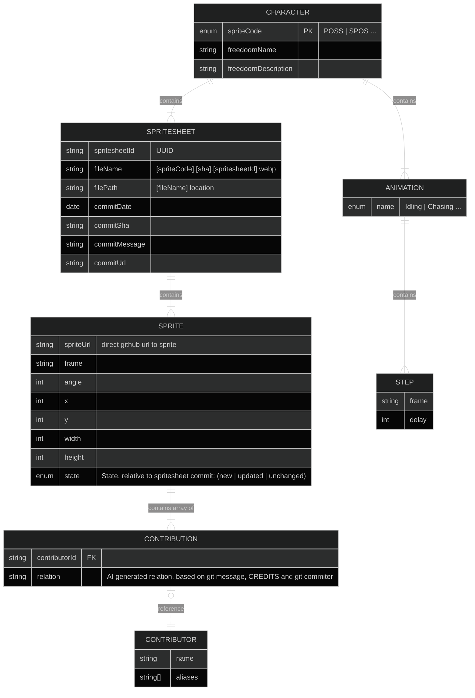

This package acts as a database for freedoom bestiary tools and web page. `/packages`
It stores

- static data (data which created ones and can be edited manually, eg: animation sequences or character description)
- dynamic data, which generated by `parser` or `spritesheet-generator`. This data
  may be updating (by realtime parser and generator, which will respond to future commits)

For now, data just stored in `.jsonc` files, but this may be change to some DB in future

## Usage

Database must be used(CRUD) only via `/database/repository` repositories.
It is prohibited to consume or edit `/database/data` directly.

```tsx
// Correct usage
import { ParsedCharacterRepository } from "@freedoom-bestiary/database";
const parsedCharacter = await ParsedCharacterRepository.getParsedCharacter(code);
```

## Data structure for freedoom bestiary



## Character

Static entity, with pre-defined standard Doom2 properties and extra FreeDoom-related data. It is either enemy ("POSS" | "FATT" ...) or player "PLAY"

## Animation

Static entity, containing standard sequences of animations for characters from Doom2

## Spritesheet

A specific version(snapshot) of a single character's design. Snapshot is created from git commit if any of character's sprites were changed. It combines new(updated) sprites of specific character in a single spritesheet. If not all sprites for given character were changed, the existing sprites used to fill out missing frames to create a complete spritesheet with all required sprites for given character. Spritesheet is `.webp` file with grid-based sprite placement (rows - angles, columns - frames) and complimentary data, such as git metadata for commit and authorship of each sprite
